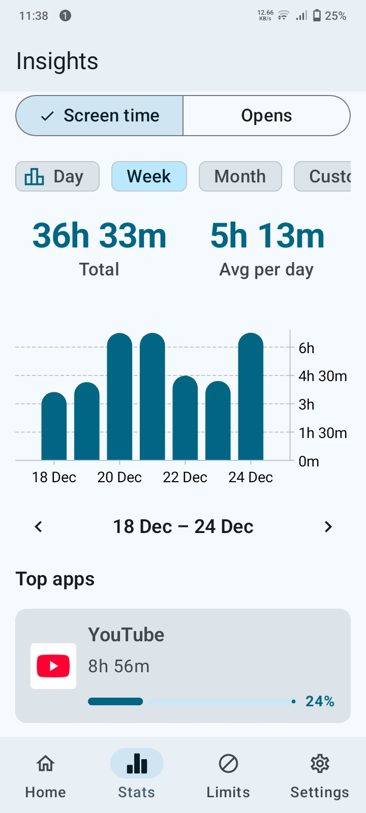
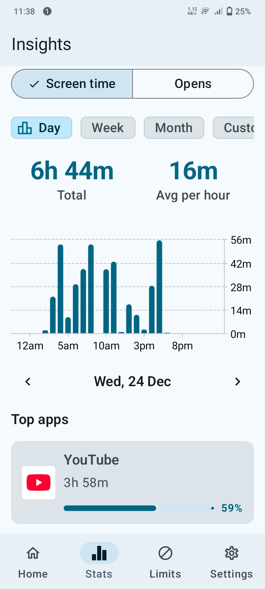

# LibreFocus 📱

> A native Android application designed to help users reduce screen time and promote healthier digital habits through data visualization, behavioral insights, and gamification.

[](https://kotlinlang.org)
[](https://developer.android.com/jetpack/compose)
[](LICENSE)

---

## 🎯 Overview

LibreFocus is a work-in-progress Android screen time management app built with modern Android development practices. The app tracks app usage patterns and provides users with actionable insights to build better digital habits.

## ✨ Features

### ✅ Implemented
- **Usage Analytics** - Daily, weekly, and monthly statistics with interactive charts
- **Real-time Tracking** - Background sync of app usage data every 15 minutes
- **Customizable Insights** - Multiple metrics (usage time, app launches, device unlocks)
- **Date & Time Preferences** - User-configurable formatting with timezone support
- **Material You** - Dynamic theming with system color integration
- **Onboarding Flow** - Smooth user introduction and permission management

### 🚧 Planned
- App categorization with auto-classification
- Focus mode and app blocking
- Gamification (badges, streaks, achievements)
- AI-driven personalized recommendations
- Backup & restore functionality

## 📸 Screenshots

<p align="center">
  
  
</p>

## 🛠️ Tech Stack

**Architecture & Design**
- MVVM (Model-View-ViewModel) Pattern
- Jetpack Compose for declarative UI
- Material 3 Design System

**Core Libraries**
- **Koin** - Dependency injection
- **Room** - Local database with DAO pattern
- **DataStore** - Preferences management
- **WorkManager** - Background task scheduling
- **Kotlin Coroutines & Flow** - Reactive asynchronous programming

**Planned**
- **Ktor** - HTTP client for cloud sync
- **Accessibility Service** - App blocking implementation

## 🏗️ Project Structure

```
com/librefocus/
├── data/          # Data layer (Room, DataStore, repositories)
├── di/            # Dependency injection modules
├── models/        # Data models
├── ui/            # UI layer (Compose screens & ViewModels)
├── utils/         # Utility classes
├── workers/       # Background workers
└── services/      # Foreground services
```

## 🚀 Getting Started

### Prerequisites
- Android Studio Hedgehog or later
- JDK 17+
- Android SDK 24+ (Minimum) / 34+ (Target)

### Installation
1. Clone the repository
   ```bash
   git clone https://github.com/hammadbawara/librefocus.git
   ```
2. Open the project in Android Studio
3. Sync Gradle dependencies
4. Run on an emulator or physical device

### Permissions Required
- **Usage Access Permission** - To track app usage statistics
- **Notification Permission** - For background sync notifications (Android 13+)

## 📊 Database Schema

The app uses Room database with the following entities:
- `AppEntity` - Installed application metadata
- `AppCategoryEntity` - App categories (predefined & custom)
- `HourlyAppUsageEntity` - Hourly usage aggregation
- `DailyDeviceUsageEntity` - Daily unlock counts
- `SyncMetadataEntity` - Incremental sync tracking

## 🤝 Contributing

This project is currently in active development. Contributions, issues, and feature requests are welcome!

## 📝 License

This project is licensed under the MIT License - see the [LICENSE](LICENSE) file for details.

## 👨‍💻 Author

**Your Name**
- GitHub: [@yourusername](https://github.com/yourusername)
- LinkedIn: [Your Profile](https://linkedin.com/in/yourprofile)

---

**Status:** 🚧 Work in Progress | **Last Updated:** December 2025
